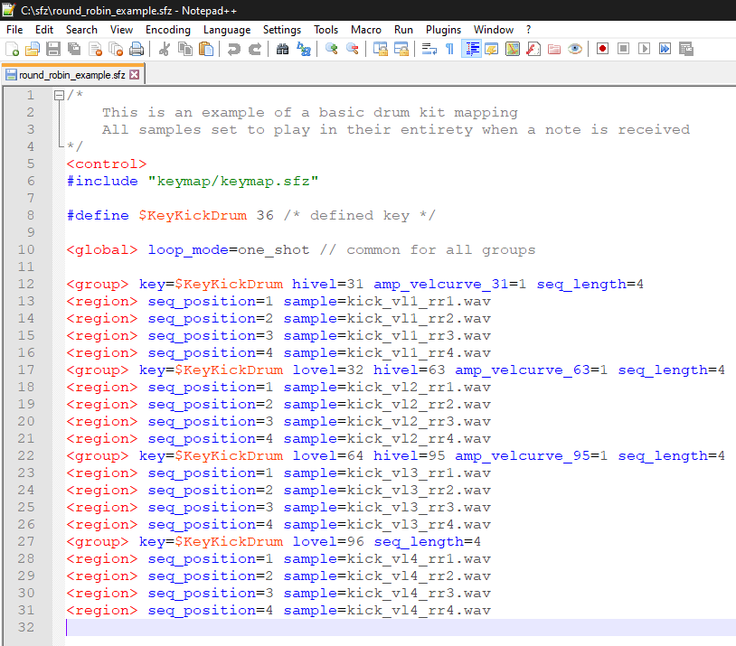

# SFZ Format Filetype Syntax Highlighting for Notepad++

## Installation

- In Notepad++: menu `Language` > `User Defined Language` > `Define your language...`
- In the `User Defined` dialog click the `Import...` button
- Select the `sfz-udl.xml` file
- Close the dialog window

## Known Bugs

- If a header and an opcode have no whitespace in between,
  the syntax highlighting will not work (e.g. `<region>sample=audio.wav`)
- Opcodes with numbers in between like egN or lfoN are not specified,
  resulting to highlight anything with the `eg` or `lfo` prefix
